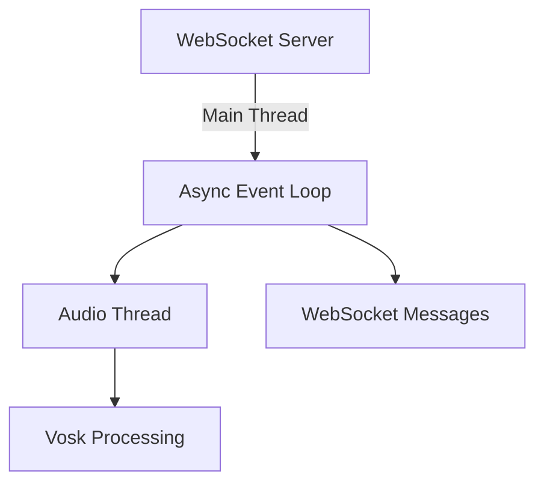

# Real-Time Audio Transcription Server with WebSocket

A local speech-to-text server that provides real-time transcription via WebSocket, designed for integration with applications like Unity games. Uses Vosk for offline speech recognition and Python for server implementation.

---

## Features
- Live microphone audio transcription
- WebSocket interface for external applications
- Cross-platform compatibility
- Configurable model path
- Non-blocking architecture

---

## Requirements
- Python 3.7+
- Vosk speech recognition model
- Required packages: `vosk`, `pyaudio`, `websockets`, `python-dotenv`

---

## Setup Instructions

### 1. Clone Repository
```bash
git clone https://github.com/yourusername/audio-websocket-server.git
cd audio-websocket-server
```

### 2. Install Dependencies
```bash
pip install vosk pyaudio websockets python-dotenv
```

### 3. Configure Vosk Model
1. Download a Vosk model from [official models](https://alphacephei.com/vosk/models)
2. Create `.env` file:
```env
MODEL_PATH=./your-vosk-model-directory
```

---

## Usage

### Start WebSocket Server
```bash
python websocket_server.py
```
Server starts on `ws://localhost:8765`

### Unity Integration Example
```csharp
// C# WebSocket Client Example
WebSocket ws = new WebSocket("ws://localhost:8765");

ws.OnMessage += (byte[] msg) => {
    string transcription = System.Text.Encoding.UTF8.GetString(msg);
    Debug.Log("Voice command: " + transcription);
};

ws.Connect();
```

---

## Technical Architecture



---

## Configuration Notes

### Audio Devices
List available microphones:
```bash
python audio_transcribe.py
```

### Model Management
- Supported languages: English, Spanish, French, etc. (depends on model)
- Multiple models can be switched by changing `MODEL_PATH`

---

## Troubleshooting

**No Audio Input**
- Verify microphone permissions
- Check audio device index in `audio_transcribe.py`
- Ensure sample rate is 16000Hz

**Connection Issues**
```bash
wscat -c ws://localhost:8765  # Test WebSocket connection
```

**Model Errors**
- Confirm .env file exists
- Verify model directory structure
- Check model compatibility

---

## License
MIT License - Free for personal and commercial use

*Note: Vosk models have separate licenses - verify compatibility with your use case*
